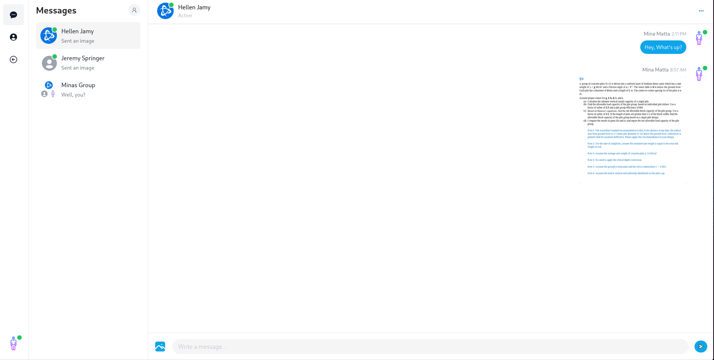
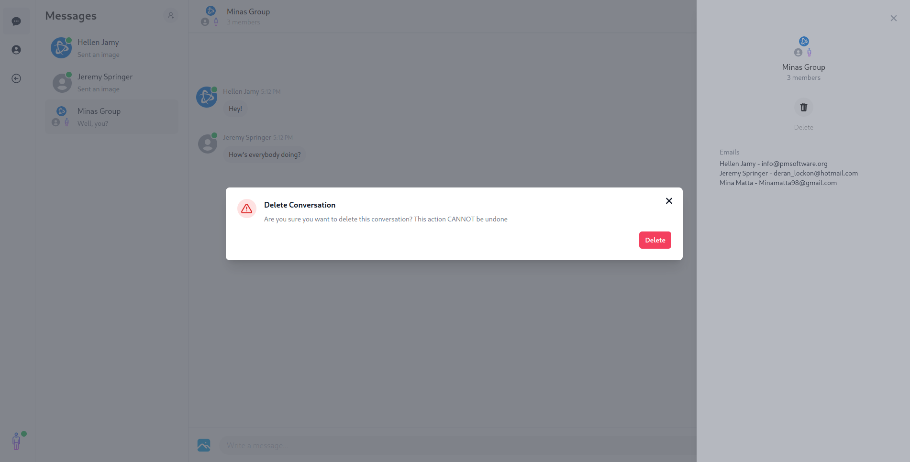

# WIP Leptos-Chatting-Client
This repository demonstrates the use of the following crates:
* [Actix-web](https://actix.rs/): Actix based backend for request management.
* [Leptos-RS](https://github.com/leptos-rs/leptos): Server Side Rendering and Hydration framework utilizing web-assembly.
* [Cargo-Leptos](https://github.com/leptos-rs/cargo-leptos): Project Building Managed via Cargo Leptos.
* [Tokio-RS](https://tokio.rs/): Asynchronous Runtime
* [Wasm-Bindgen](https://github.com/rustwasm/wasm-bindgen): JSCast Bindings via web-assembly.
* [Sea-Orm](https://github.com/SeaQL/sea-orm): Asynchronous Object Relational Mapping (ORM) used for the management of MySQL Databases.
* [Tailwind-Css](https://tailwindcss.com/): Styles on the go.
* [Redis](https://redis.io/): User Session Management via Redis value stores.
* [Askama](https://github.com/djc/askama): Templating Engine for automating verification and sign-up emails.
* [Gloo-Net](https://github.com/rustwasm/gloo): Libraries for simple control over wasm functions. Used for serialization and initiating web-socket connections. 
* [Actix-Web-Actors](https://github.com/actix/actix-web/tree/master/actix-web-actors): Web-Socket real time reactivity and chat updates, mimicking [pusher](https://pusher.com/) functionality.
* [Async-Broadcast](https://github.com/smol-rs/async-broadcast): Broadcast channels for web-socket stream handling and cross-platform access to a single connection, where 

## Features
* User Authentication and Verification
* Database Management w/ CRUD and SQL Join Statements. User Password hashing achieved via argon2.
* Asynchronous api calls
* React-like, fine grained reactive environment.
* Tailwind CSS compilation


## Preview
### Conversations



### Group Chatting


### Graceful-Suspension


## Building
To build this repository within a container, where cargo and mariadb are not installed, simply run the following command within the root directory of this project in an environment where docker is installed:

```bash
docker build -t zing .
```

Note that this building process involves compiling the release version of the project (heavily optimized) and **will** take upwards of 15-20 minutes to compile. With a ryzen 7950x3D (16 core, 32 thread CPU), this compiles in approximately 5-7 minutes.

## Running
To run this project after compilation, run the following command:

```bash
docker run -p 8000:8000 zing
```

For effective use, create 3 different user accounts to experiment with group chat functionality. Note that this will require three seperate emails, as email verification is required for sign-up.

A burner email is used for the verification process for demonstrative purposes.

## Coming Soon
The following features will be implemented soon:

* Improvements to the sign-up and login user interface.
