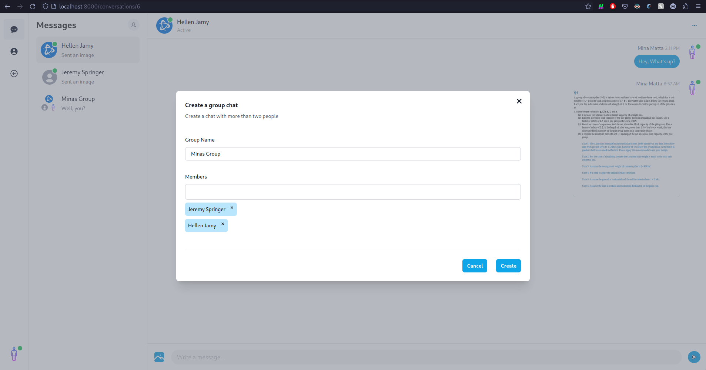

# Leptos-Chatting-Client
This repository demonstrates the use of the following crates:
* [Actix-web](https://actix.rs/): 
Actix-Web based backend framework for request management.

* [Leptos-RS](https://github.com/leptos-rs/leptos):
Server Side Rendering and Hydration framework utilizing web-assembly. A full-stack framework implementing [*Next-Js*](https://nextjs.org/) *like* front-end and back-end technical implementation. For example, server functions implemented via the [#server](https://docs.rs/leptos/latest/leptos/attr.server.html) macro, do not require a fetch/GET request (via [reqwest](https://docs.rs/reqwest/latest/reqwest/) or similar asynchronous HTTP clients) and do not need type casting.

* [Cargo-Leptos](https://github.com/leptos-rs/cargo-leptos):
Project Building Managed via Cargo Leptos.

* [Tokio-RS](https://tokio.rs/):
Asynchronous Runtime for polling futures and yielding back to the executor, where an operation would otherwise be blocking. For example, [std::fs](https://doc.rust-lang.org/std/fs/) has been replaced with [tokio::fs](https://docs.rs/tokio/latest/tokio/fs/index.html) for non-blocking I/O implementation and scheduling.

* [Wasm-Bindgen](https://github.com/rustwasm/wasm-bindgen):
JSCast Bindings via web-assembly.

* [Sea-Orm](https://github.com/SeaQL/sea-orm):
Asynchronous Object Relational Mapping (ORM) used for the management of MySQL Databases. Most importantly, baseline security measures such as prepare statements for deflecting injections are automatically managed via Sea-Orm.

* [Sea-Migrations](https://docs.rs/sea-migrations/latest/sea_migrations/):
Database setup and version control, for cross-system migration and synchronisation. [Migrations](https://www.sea-ql.org/SeaORM/docs/next/migration/writing-migration/) and database setup (table by table breakdown) is available [here](https://github.com/MinaMatta98/Leptos-Chatting-Client/tree/main/src/migrator).

* [Tailwind-Css](https://tailwindcss.com/):
Styles on the go.

* [Redis](https://redis.io/):
User Session Management via Redis key-value stores. Implementation achieved with [actix-identity](https://docs.rs/actix-identity/latest/actix_identity).

* [Askama](https://github.com/djc/askama):
Templating Engine for automating verification and sign-up emails.

* [Gloo-Net](https://github.com/rustwasm/gloo):
Libraries for simple control over wasm functions. Used for serialization and initiating web-socket connections. 

* [Actix-Web-Actors](https://github.com/actix/actix-web/tree/master/actix-web-actors):
[Web-Socket](https://javascript.info/websocket) real time reactivity and chat updates, mimicking [pusher](https://pusher.com/) functionality. This allows for real time chat and icon updates, including tracking of members connected to a specific conversation.

* [Async-Broadcast](https://github.com/smol-rs/async-broadcast):
Broadcast channels for web-socket stream handling and cross-platform access to a single connection, where a connection impl !Send. In practical fashion, this entails a single access point to a sender, via clonable receivers which can be distributed, meaning that a single access point is needed for the connection, but a bridge may be established via a single non-blocking listener being polled via [select!](https://docs.rs/futures-util/latest/futures_util/future/fn.select.html). For types that do not implement Send, a classical access approach is via a single entry point to a sender, as demonstrated below.
```rust
               ┌───────────────────┐          Poll          ┌────────────────────────────┐ 
               │      Sender        │       ◀─────────     │    Object/Stream (!Send)    │
               └─────────┬─────────┘                        └────────────────────────────┘
                          │ 
                          ▼ 
               ┌───────────────────┐
               │    Broadcast       │
               └─────────┬─────────┘
                          │ 
         ┌───────────────┴──────────────────┬───────────...───────────┐
         │                                     │                            │
 ┌──────┴────────────┐             ┌────────┴────────┐          ┌───────┴───────────┐
 │   Receiver 1       │             │   Receiver 2     │   ...   │    nth Receiver    │
 └───────────────────┘             └─────────────────┘          └───────────────────┘
```
## Features
* User Authentication and Verification.
* Database Management w/ CRUD and SQL Join Statements. User Password hashing achieved via argon2.
* Asynchronous api calls.
* React-like, fine grained reactive environment.
* Tailwind CSS compilation.


## Preview
### Conversations


### Group Chatting


### Graceful-Suspension


## Building
To build this repository within a container, where cargo and mariadb are not installed, simply run the following command within the root directory of this project in an environment where docker is installed:

```bash
docker build -t zing .
```

Note that this building process involves compiling the release version of the project (heavily optimized) and **will** take upwards of 15-20 minutes to compile. With a ryzen 7950x3D (16 core, 32 thread CPU), this compiles in approximately 5-7 minutes.

## Running
To run this project after compilation, run the following command:

```bash
docker run -p 8000:8000 zing
```

For effective use, create 3 different user accounts to experiment with group chat functionality. Note that this will require three separate emails, as email verification is required for sign-up.

A burner email is used for the verification process for demonstrative purposes.

## Coming Soon
The following features will be implemented soon:

* Improvements to the sign-up and login user interface.
